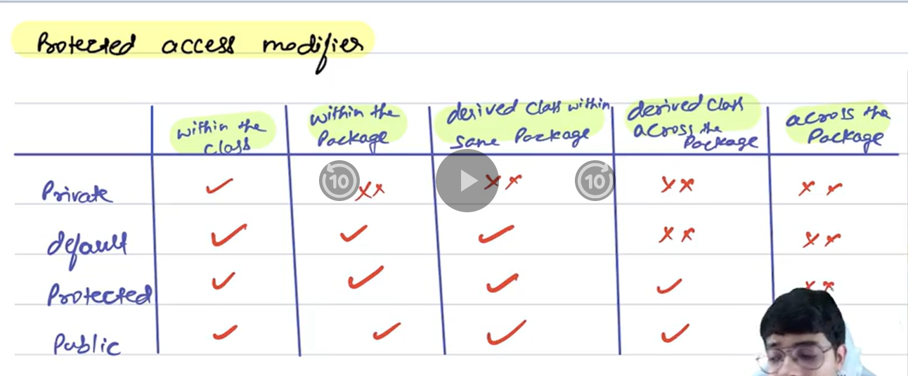

## ✅ Protected Access Modifier in Java

### 🔹 What is `protected`?
The `protected` access modifier allows a member (variable or method) to be **accessible within the same package** and also by **subclasses in other packages**.

### 🔹 Access Level


### 🔹 Use Case
Suppose you are developing a **framework or base class** that other teams or applications will **extend and customize**. You want to **hide implementation details** but allow **controlled access** to certain members for subclasses—this is where `protected` is useful.

---

## 🧑‍💻 Example Code

### 📁 Package: `animals`

```java
// File: Animal.java
package animals;

public class Animal {
    protected String name;

    protected void makeSound() {
        System.out.println("Animal makes a sound");
    }
}
```

---

### 📁 Package: `zoo`

```java
// File: Dog.java
package zoo;

import animals.Animal;

public class Dog extends Animal {
    public void speak() {
        name = "Dog"; // allowed due to protected
        System.out.println(name + " says: ");
        makeSound();  // allowed due to protected
    }

    public static void main(String[] args) {
        Dog dog = new Dog();
        dog.speak();
    }
}
```

---

### 📝 Output
```
Dog says: 
Animal makes a sound
```

---

## 🧠 Summary

- `protected` is more accessible than `private` but more restricted than `public`.
- It’s ideal when designing **inheritance-based systems** where you want subclasses to access members, but you don’t want them exposed to everyone.
- Helps in **encapsulation and controlled exposure** in OOP.
