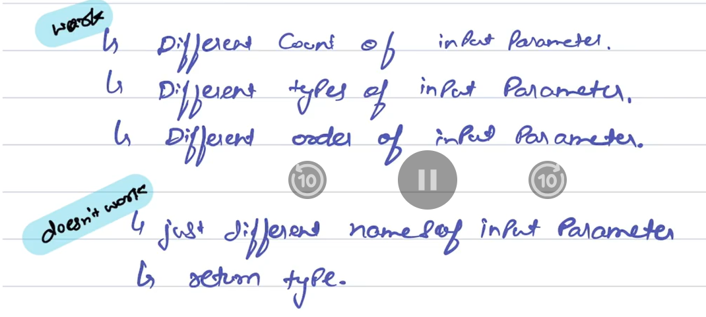

# Compile-time Polymorphism 

## 📌 What is Compile-time Polymorphism?

- Compile-time polymorphism (also known as **static polymorphism or method overloading**) is a feature in java where multiple methods can have the same name but different parameters within the same class.
- The decision about which method to invoke is made by the compiler at **compile time** via method overloading.

## ⭕ How it Works?

- Java resolves overloaded method calls at **compile time** based on the **method signature** (method name  + number/types/order of parameters).
- This allows the same method to behave differently depending on the arguments passed. 

## ☑️ Use Cases
- When we want to perform a similar operation in different ways depending on input. 
- Improving code readability by using the same method name for related behaviours. 

## 🧪 Example Code: Method Overloading 

### Example 1 
```java
public class Calculator{
    // Method to add two integers
    public int add(int a, int b){
        System.out.println("Method One");
        return a+b;
    }

    // Overloaded method to add three integers 
    public int add(int a, int b, int c){
        System.out.println("Method Two");
        return a+b+c;
    }

    // Overloaded method to add two double values
    public double add(double a, double b){
        System.out.println("Method Three");
        return a+b;
    }
    
    public static void main(String[] args){
        Calculator calc = new Calculator();

        System.out.println("Sum of 2 and 3: " + calc.add(2,3));
        System.out.println("Sum of 2, 3 and 4: " + calc.add(2, 3, 4));
        System.out.println("Sum of 2.5 and 3.5: " + calc.add(2.5, 3.5));
    }
}
```

### 📤 Output 

```
Method One
Sum of 2 and 3: 5
Method Two
Sum of 2, 3 and 4: 9
Method Three
Sum of 2.5 and 3.5: 6.0
```

### Example 2 

```java
class methodOverloading{
  void check(int val1){
    System.out.println("Method one is running.");
  }
  
  void check(String val1){
    System.out.println("Method two is running");
  }
  
  void check(int val1, double val2 ){
    System.out.println("Method three is running");
  }
  
  void check(double val2, int val1){
    System.out.println("Method four is running");
  }
  
  public static void main (String[] args) {
    methodOverloading md = new methodOverloading();
    
    md.check(10);
    md.check("saurabh");
    md.check(10, 30.5);
    md.check(30.5, 10);
  }
}
```

### 📤 Output
```
Method one is running.
Method two is running
Method three is running
Method four is running
```

## 🏡 Real-life Example 

### 📞 Phone Example
Imagine you’re calling someone:

- call(String contactName)
- call(int contactNumber)
- call(String contactName, boolean videoCall)

All are call methods, but depending on input, the action varies. This is similar to method overloading in compile-time polymorphism.

--- 

## 🔚 Conclusion



- Compile-time polymorphism helps to achieve method reusability and cleaner code. It enhances readability and allows the developer to use the same method name for similar operations with different inputs.