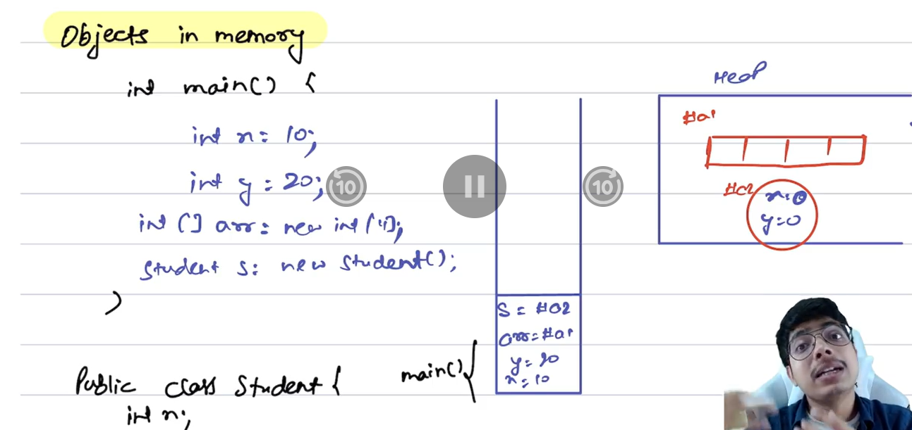
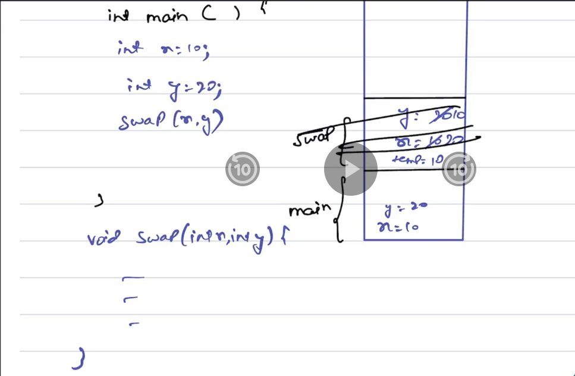
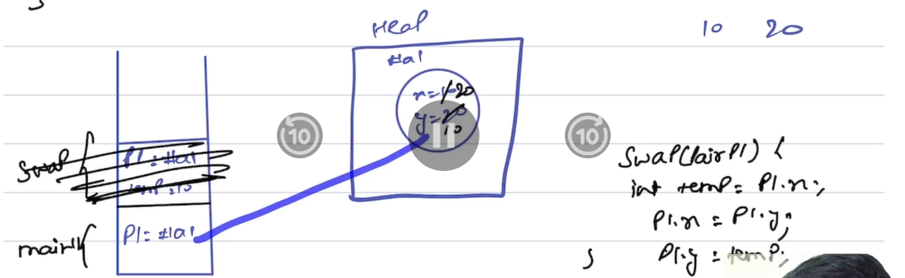

# Understanding Java: Pass by Value & Objects in Memory

## 📌 Objects in Memory

- When an object is created in Java, memory is allocated to store its data.
- The amount of memory depends on the size and type of the object's fields.
- **Instead of storing the entire object’s data in a variable**, Java stores a **reference (memory address)** to the object's location in memory.
- This means **multiple variables can point to the same object** in memory.

### 🔁 Memory Allocation:

- **Primitive types** like `int`, `long`, `double`, `float` are stored in **stack memory** because their size is predefined by Java creators.
- **Arrays, objects, and classes** are stored in **heap memory**.

 

## 📌 Pass-by-Value in Java

### Example 1: Swapping Primitive Values

```java
public class Main {
    public static void main(String[] args) {
        int x = 10;
        int y = 20;

        System.out.println(x + " " + y); // Output: 10 20

        swap(x, y);

        System.out.println(x + " " + y); // Output: 10 20
    }

    public static void swap(int x, int y) {
        int temp = x;
        x = y;
        y = temp;
    }
}
```

### ❌ Why swapping doesn't work here?

- Java is **pass-by-value**, even for primitives.
- `swap(x, y)` swaps **copies** of `x` and `y`, not the actual variables from `main()`.
- Changes made inside `swap()` do **not** affect the original variables.
 

### 📌 How to Swap Actual Values?

You need to use:
- A **wrapper class**
- A **container**, like an array or a custom class, because these are passed as **references** (technically, the reference value is passed by value).

### Example 2: Swapping Using an Object

```java
class Pair {
    int x;
    int y;

    Pair(int v1, int v2) {
        x = v1;
        y = v2;
    }
}

public class Main {
    public static void main(String[] args) {
        Pair p1 = new Pair(10, 20);

        System.out.println(p1.x + " " + p1.y); // Output: 10 20
        swap(p1);
        System.out.println(p1.x + " " + p1.y); // Output: 20 10
    }

    public static void swap(Pair p1) {
        int temp = p1.x;
        p1.x = p1.y;
        p1.y = temp;
    }
}
```


### 💡 Key Concept: Java is Always Pass-by-Value

- Even for objects, **Java passes a copy of the reference**, not the actual reference itself.
- Therefore:
  - You **can change the internal state** of the object using the copied reference.
  - You **cannot change the object’s reference itself** inside the method.


### 🧠 Behind the Scenes: What Happens Internally?


1. In `main()`, you create an object `p1` with values `(10, 20)`.
2. You pass `p1` to `swap(p1)`.
3. Java passes a **copy of the reference** to the object.
4. Inside `swap()`, `p1.x` and `p1.y` refer to the **same object in memory** as in `main()`.
5. So modifying the fields (`x`, `y`) **modifies the original object**.


## 🏠 Analogy

- Think of `p1` as a **house**.
- The reference is the **address** to the house.
- You give someone a **copy of the address**, not the house.
- But using that address, they can **enter the same house and rearrange the furniture (internal fields)**.
- They **cannot replace the entire house** with a new one — just change what’s inside.

---
